# DAS Cable Anomaly Detection — Submarine Power-Cable Health Monitoring

Predictive-maintenance case study based on the CRISP-DM methodology, applied to
**Distributed Acoustic Sensing (DAS)** data from a submarine telecom fiber. Covers raw strain-rate
signal processing and DSP feature engineering, through fully **unsupervised anomaly detection**, to
an honest evaluation of what's actually validated versus what's still open.


The diagram above is this project's own scope map, not aspirational: stages 1–5 (blue) are what this
revision implements — business understanding through evaluation of an anomaly-*detection* model.
Stages 7–9 (red) — event *localisation*, *classification* and their evaluation, and deployment — are explicitly **out of scope for this revision**, not silently
dropped. See [Limitations & Next Steps](#limitations--next-steps) for why, and what each would need.

---

## Business Understanding

**Problem**: submarine power cables are expensive to inspect and expensive to repair. A vessel
dragging an anchor, dropping equipment, or otherwise interacting with the seabed near a cable can
damage it — sometimes catastrophically, sometimes as a slow-building risk that isn't obvious until
the cable actually fails. Distributed Acoustic Sensing turns any pre-installed telecom fiber running
alongside (or the same route as) the power cable into a continuous strain sensor along its entire
length, at every point, all the time — the fiber itself is the sensor.

**Why unsupervised, and why that's a real constraint, not a technique choice.** There is no labelled
"this specific window was a real anomalous event" dataset for this cable. No incident occurred (that
we know of) during the recording window, and there's no independent ground-truth log of vessel
transits, seabed activity, or cable-adjacent events to validate against. That means this project
cannot report precision, recall, F1, or "accuracy" for anything — those all require a true label to
compare against, and there isn't one. Every quality signal in this project is a **proxy**: internal
consistency, rank agreement between two independently-built detectors, and qualitative plausibility
checks — never a validated detection rate. This is stated up front because it shapes every modelling
decision downstream, not as a caveat tacked onto the end.

**What "success" looks like here, realistically**: not "the model achieves X% accuracy" (there's
nothing to measure that against), but "the pipeline produces a short, spatially-coherent, ranked list
of candidate windows that a human reviewer could plausibly investigate further" — screening, not
classification.

---

## Data Understanding

- **Source**: [PubDAS](https://github.com/PubDAS/PubDAS) — Valencia-IslaLink sub-dataset, contributed
  by the University of Michigan Photonic Seismology Lab with the Spanish National Geographic
  Institute and IslaLink, hosted on a public Globus guest collection.
- **Cable**: a pre-installed telecom fiber running Valencia (mainland Spain) to Mallorca — the first
  50 km recorded, ~9.2 km onland/shallow-water, ~40.8 km undersea (deep water).
- **Interrogator**: Febus A1-R. Strain rate, downsampled to **250 Hz**, **16.8 m** channel spacing,
  **30.4 m** gauge length, 2977 channels total.
- **Recording window**: Sept 1–7, 2020, split by PubDAS into hourly folders ("events") of six
  10-minute HDF5 files each (~1.78 GB/file, ~10.7 GB/hour).
- **What's actually downloaded**: a `MAX_HOURS`-capped subset (currently 4 of the available hours,
  ~42.7 GB) — a disk-space cap, not a dataset limit. The pipeline is designed around *multiple*
  hour-folders being the norm; nothing about the modelling assumes exactly 4.

**Onland/shallow-water channels are excluded everywhere** — filtered by the geometry file's own
depth column (channels with depth ≤ 50 m), not a hardcoded channel index — leaving a deep-water-only
channel range for every downstream step.

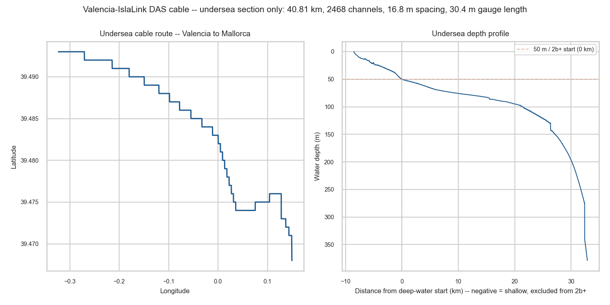
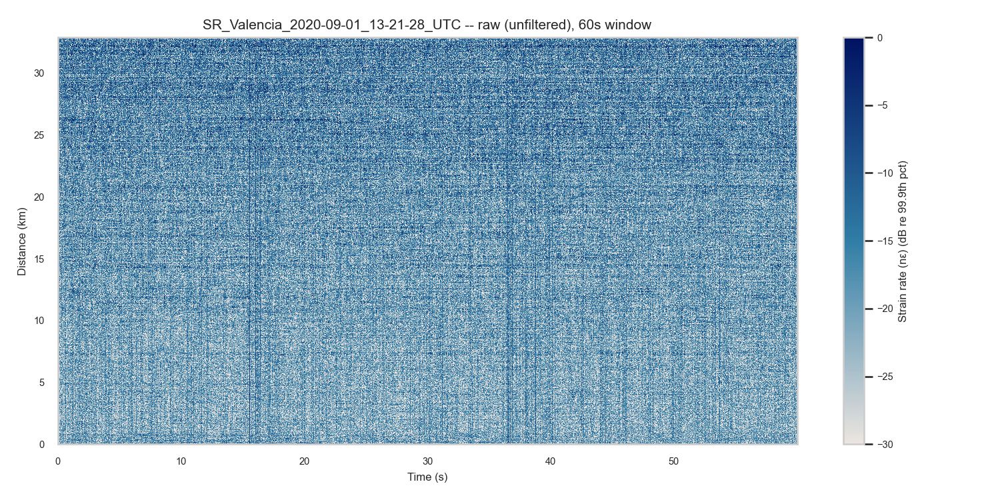
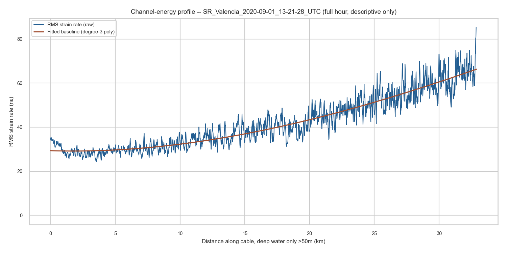

**Key data-understanding finding**: per-channel baseline RMS *increases with distance from the
interrogator* — verified directly, not assumed (roughly 2× baseline RMS at ~30 km versus ~5 km, with
no anomaly present at either). This is optical attenuation degrading signal-to-noise with distance,
documented independently for this class of interrogator. It matters a great deal downstream: any
fixed anomaly threshold would systematically flag far-end channels as "anomalous" by default just
because they're noisier, not because anything unusual happened there — see
[Feature Engineering](#feature-engineering) for how this is corrected.

A second finding from this stage: a persistent narrowband tone pair (~48 Hz, ~63 Hz) near the cable's
far end shows up at consistent frequency and magnitude across every downloaded hour — too stable to
be a passing vessel, more consistent with a fixed mechanical or electrical noise source (48 Hz is a
plausible motor-slip frequency just below Spain's 50 Hz grid frequency).

---

## Preprocessing

Raw strain rate goes through one pipeline (`utils/data_preprocess.preprocess_channels()`) before
anything else touches it:

1. **Bad-channel screen + interpolation** — detects and interpolates across dead/saturated channels.
2. **Common-mode removal** — subtracts the shared component across channels (instrument-wide noise
   that isn't specific to any one point on the cable).
3. **Detrend + bandpass filter** — currently 2–124 Hz, re-derived from this project's own
   vessel/shipping-noise frequency-band research, not inherited unchanged from an unrelated recipe.
4. **f-k apparent-velocity highpass** — a wave-*type* separation filter (`fk_filter()`): passes only
   energy whose apparent velocity along the cable exceeds a lower bound (currently 1400 m/s, an
   unverified water-borne-acoustic-speed starting guess). This is explicitly **not** source
   localisation or beamforming — it's a highpass on *how fast a wavefront appears to move along the
   fiber*, which near-field crossings (like a vessel passing directly over the cable) naturally span
   from true propagation speed up to near-infinite right at the crossing point, so no finite upper
   cutoff is used.
5. **Distance-baseline normalisation** — mean-centers each channel against a smooth curve fit to the
   RMS-vs-distance trend (fit on `energy^0.5`, the variance-stabilizing transform, not raw energy).

**Where does the apparent-velocity cutoff actually sit?** The f-k spectrum below is computed on the
signal *before* the f-k highpass (step 4) — the reference line marks `FK_C_LOW`, so what's visibly
being removed (everything below the line) is checkable against where this hour's real energy actually
concentrates, not just asserted.

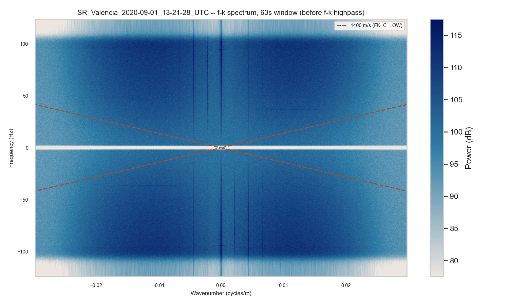
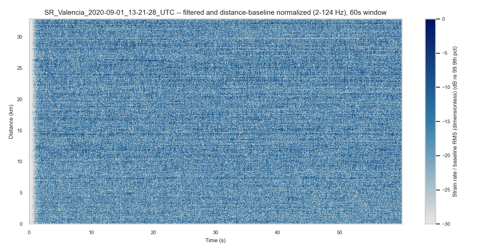
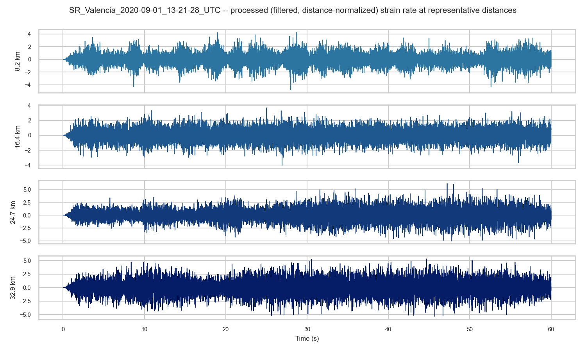
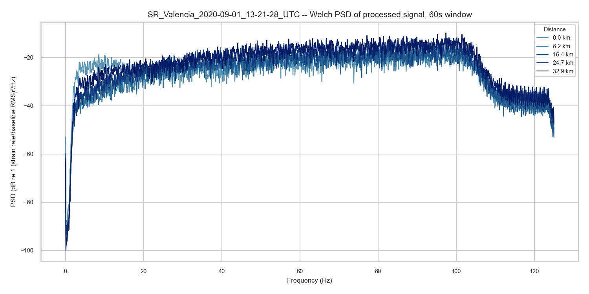

---

## Feature Engineering

**Sliding-window DSP features**, computed per channel, per 10-second window with 5-second hop
(`utils/dsp_features.extract_window_features()`):

| Domain | Feature | What it measures |
|---|---|---|
| Time | RMS | Overall signal energy in the window |
| Time | Peak | Maximum absolute amplitude |
| Time | Crest factor | Peak ÷ RMS — rises when isolated spikes stand out against background |
| Time | Kurtosis | Impulsiveness of the signal |
| Frequency | Welch PSD band energies | Power in a small set of non-uniform bands, concentrated in the low-frequency vessel-relevant range (2–8, 8–20, 20–35, 35–50, 50–90, 90–124 Hz) |
| Frequency (optional) | WPD sub-band energies | 8 equal-width wavelet-packet sub-bands, `db4`, level 3 |

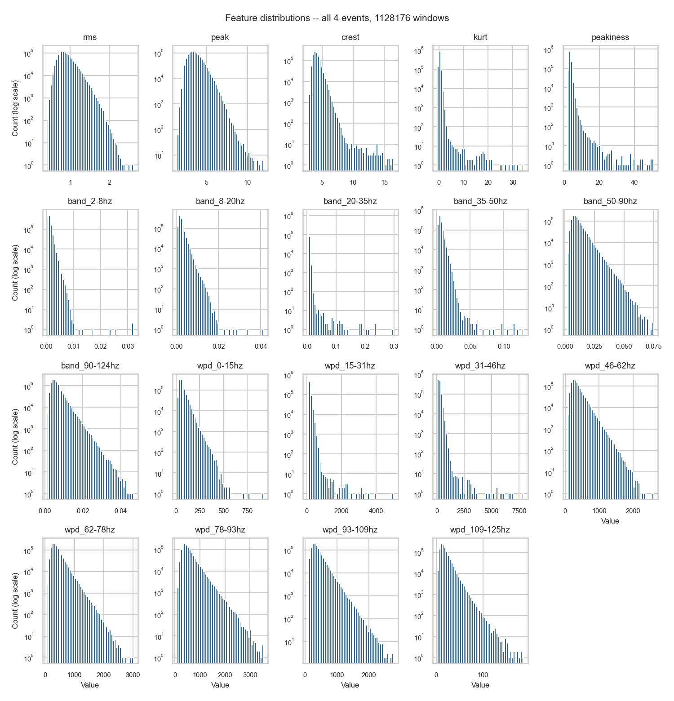
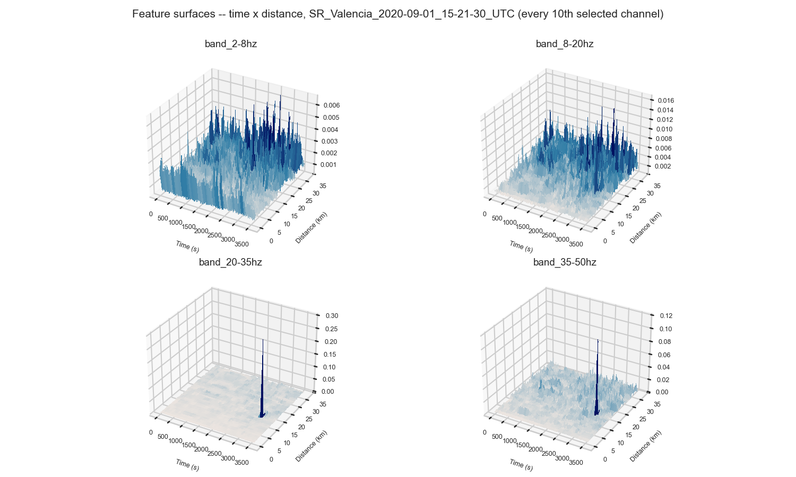

**Distance decorrelation — the fix that actually mattered.** The raw-signal-level baseline correction
(above) alone is *not* sufficient: verified directly that with only that correction, the model's flag
rate climbed from ~0.3% near the interrogator to ~14% at the far end (~45×) on real held-out data —
the model was substantially learning "this window is far away," not detecting real anomalies. Two
compounding causes, both root-caused rather than papered over: (1) ratio features like crest factor
and kurtosis are scale-invariant, so *no* signal-level scaling can ever touch them — the limitation is
structural; (2) band/WPD energies keep residual correlation with distance because different frequency
bands attenuate differently, which one broadband curve can't capture per-band. **Fix**: a separate
mean *and* scale curve is fit **per feature** (not per raw signal), fit on training-fold events only
and applied to both train and held-out test rows — after this, the flag-rate gap across distance drops
to ~2–7%, roughly flat.

**Split discipline**: chronological, always — never random, even as an interim default with few
events. The 3 earliest downloaded event-hours are the training set; the most recent hour is the
held-out test set. Windows within one event recording are highly temporally/spatially correlated
(same source, same noise floor, same instrument state), so a group boundary at the event level
prevents a single event's windows from spanning both train and test.

---

## Modeling

**Isolation Forest** (`n_estimators=100`, `contamination='auto'`) — the only model registered.
Hyperparameters are fixed values, not searched: there's no label-based score to select a "best"
candidate against, so a search would have nothing real to optimise. Wrapped in a
`sklearn.Pipeline([("scaler", StandardScaler()), ("model", clf)])`, refit inside the training split.

**One-Class SVM was tried and dropped, not adapted.** Its libsvm-backed fit had to be subsampled
(5,000 of ~846K training rows) for tractable runtime, and the resulting model correlated only weakly
with both Isolation Forest and an independent hand-crafted baseline detector (Spearman ρ ≈ 0.58,
versus ≈ 0.92 between Isolation Forest and the baseline) — more consistent with subsampling noise
than a genuine second signal, and not worth chasing on a project that isn't ML-architecture-focused.

---

## Evaluation

**There is no ground truth anywhere in this dataset.** Every number below is a proxy, explicitly
labelled as such — never precision, recall, F1, or accuracy.

1. **Rank correlation against an independent, non-ML baseline** — a hand-crafted z-score/L2-norm
   detector (ported from an earlier exploratory notebook, generalized to all 19 features), compared
   to Isolation Forest via **Spearman rank correlation** on continuous scores, not a boolean agreement
   rate. High correlation is weak evidence both are picking up a real shared signal; it is not proof
   either is right.
2. **Qualitative check against any independently documented event metadata**, where it exists —
   supporting evidence at best, and only available for the handful of events with published
   timing.

---

## Anomaly Candidate Screening

Turning a continuous per-window anomaly score into a short, reviewable list of candidates is its own
step, not just a plot — a single isolated high-scoring channel/window cell is far more likely to be
sensor or preprocessing noise than a real physical event.

**Screening criterion**: within *any* sliding 400 m span of scored channels, at least 80% must exceed
an empirical threshold (the 99th percentile of the held-out event's own Isolation Forest score) in the
same 10-second window — a **density** requirement, not a strict "every single channel must pass" rule,
so one channel dipping below threshold from score noise doesn't disqualify an otherwise-real region.
Qualifying windows that are close in time (within 30 seconds) and spatially overlapping are merged
into one region; regions backed by fewer than 2 merged windows are dropped (a single 10-second slice
isn't long enough to trust as a real physical event on its own — confirmed by checking real output,
not assumed).

**Every downloaded hour is scanned this way**, not just a fixed zoom, and every surviving region
becomes one numbered candidate — trainable events' candidates are explicitly marked in-sample (the
model saw those exact windows during fitting, so a high score there is weaker evidence than a
candidate from the held-out hour).

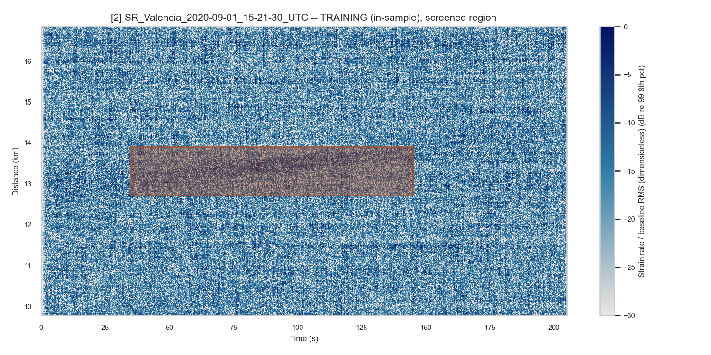
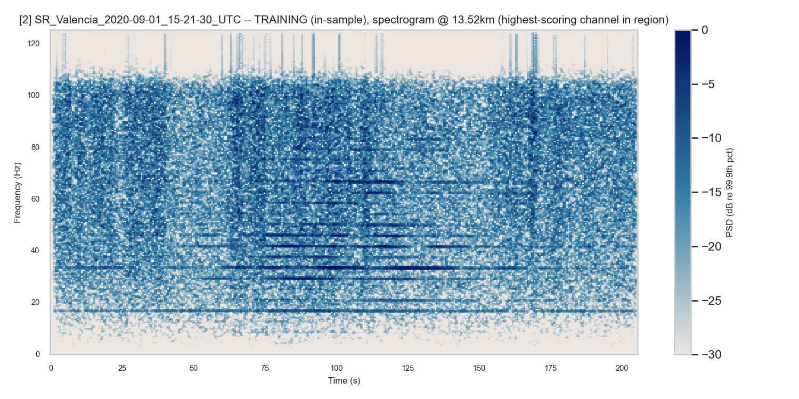

(Exact candidate numbering depends on the current screening parameters — `SCREEN_SCORE_PERCENTILE`,
`DENSITY_WINDOW_M`, `MIN_DENSITY`, `MERGE_MAX_GAP_SEC`, `MIN_WINDOWS_MERGED` — and will shift if any of
those are re-tuned; none of the five is validated against ground truth, so treat any specific
combination as a starting point to experiment from, not a final answer.)

---

## Explainability

SHAP `TreeExplainer` on Isolation Forest's continuous anomaly score — "which features pushed this
window's anomaly score up," not "which features drove this class probability" (there are no classes
here). Computed on held-out event windows only, never on training windows.

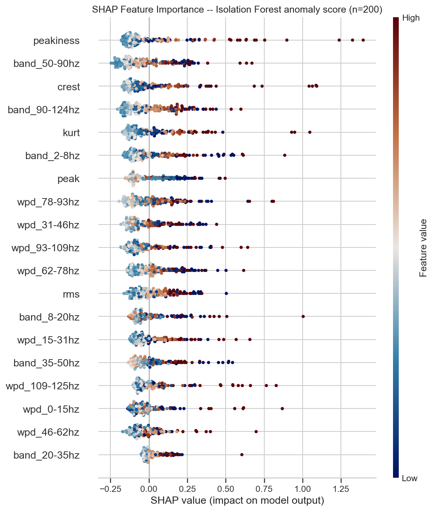

---

## Deployment

**Removed for this revision, not implemented.** An earlier revision of this project inherited a
FastAPI + Docker inference service unmodified from a predecessor project — it still expected `.mat`
file uploads and returned bearing-fault classes, neither of which applies to DAS strain-rate data.
Rather than leave that half-adapted and misleading, it's been deleted. The real blocker to rebuilding
it isn't effort, it's an undecided design question: a DAS inference request would need to accept
either a raw strain-rate window (how many channels? what duration?) or a pre-extracted feature vector
— there's no obvious default the way "one `.mat` file in, one class out" was for the bearing project,
and guessing a contract just to have *something* here would misrepresent where this project actually
is. If this returns in a future revision, it would reuse the same `AnomalyDetectionPipeline`,
preprocessing, and feature-extraction functions this notebook already exercises, and load from the
MLflow registry this notebook already logs to (`mlruns/`, `das_anomaly_isolationforest`) — the model
itself doesn't need to change, only a decided request contract and a service wrapped around it.

### Quick Start

```bash
conda activate das-py311
pip install -r requirements.txt
jupyter lab DAS_Training.ipynb   # downloads data automatically if missing (requires Globus setup, see below)
```

**Dataset download** requires a one-time `globus login` (an already-authenticated Globus CLI session)
and Globus Connect Personal installed and running with the data directory added to its access
allow-list — see `utils/download_dataset.py`'s module docstring for the exact steps.

---

## Project Structure

```
distributed-acoustic-sensing/
├── DAS_Training.ipynb       # End-to-end CRISP-DM pipeline (DSP → Isolation Forest → MLflow)
├── requirements.txt         # Pinned training dependencies
├── utils/
│   ├── download_dataset.py  # Globus-based PubDAS dataset downloader
│   ├── data_loader.py       # HDF5 (Febus A1-R) loading, per-event/per-channel access
│   ├── data_preprocess.py   # preprocess_channels() -- the full raw-to-model-ready pipeline
│   ├── dsp_features.py      # extract_window_features() -- sliding-window DSP feature extraction
│   ├── anomaly_models.py    # AnomalyDetectionPipeline + chronological-grouped CV helpers
│   └── plot_style.py        # Single source of truth for all figure styling
├── mlruns/                  # MLflow tracking + model registry (committed to git)
├── pubDAS_data/             # Raw dataset (gitignored -- large; small reference files kept in git)
├── plots/                   # Exported figures embedded in this README
└── old/                     # Archived prior projects -- reference only, not imported by anything
```

No `deployment/`, no `.github/workflows/`, no `utils/test_features.py` — all removed, not just
unused (see [Deployment](#deployment) above and `CLAUDE.md` §10.5/§11/§12 for why).

---

## Limitations & Next Steps

1. **No ground truth anywhere in this dataset** — restated here deliberately, not just in Evaluation.
   Every quality signal in this project (rank correlation, spatial-density screening) is a proxy, not
   a validated detection rate.
2. **Only a handful of hours are downloaded** out of the full Sept 1–7 recording — the chronological
   train/test split is real but statistically thin; a single held-out hour says little about
   generalisation across days, weather, or shipping-traffic patterns.
3. **Source localisation (event localisation in the diagram above) is explicitly out of scope** —
   plane-wave/focused beamforming and hyperbola-fit TDOA position estimation exist in the archived
   `old/DAS_Signal_Processing.ipynb` and would require multi-channel array-geometry reasoning this
   revision deliberately doesn't touch. It's a candidate for a future phase, not a gap in this one.
4. **Event classification is likewise out of scope** — this revision screens for *candidates*, it
   does not attempt to characterise or type what kind of event a candidate might be.
5. **No documented ground-truth events to validate most hours against** — only the screening step's
   spatial-density heuristic, and any independently published event metadata where it exists, offer
   qualitative support. A real deployment would need either instrumented validation events or a much
   longer observation period before trusting flagged candidates operationally.
6. **Deployment** — see the section above; the request contract needs to be decided before a service
   is worth building.

---

## Future Plans

The four red stages in the workflow diagram at the top of this README are not scheduled work — they're
recorded here so the plan doesn't only live in one diagram.

1. **Event localisation** — pinpointing a screened candidate's source position along the cable. Common approaches include hyperbola-fit TDOA (cross-correlated arrival-time picks fit to a hyperbolic moveout model) and beamforming.
2. **Event Classification** — once a candidate is screened (this revision) and localised (step 1),
   classify what kind of event it actually is (vessel transit vs. something else). Nothing built yet.
3. **Evaluation — needs AIS data.** This is the step this project is currently missing the most: real
   evaluation requires real ground truth, and the closest thing available is **AIS (Automatic
   Identification System)** ship-tracking data — the GPS position and timestamp every commercial vessel
   broadcasts. Cross-referencing a localised event's estimated position and time against AIS records
   for an actual vessel passing nearby at that time is what would finally allow a real precision/recall
   number, instead of the proxy methods (rank correlation, spatial-density screening) this revision is
   limited to without it. Until AIS data is incorporated, every quality signal in this project stays a
   proxy — that's a data gap, not a permanent ceiling.
4. **Deployment** — see [Deployment](#deployment) above; likely dependent on what steps 1–3 end up
   producing, not worth committing to a request contract before then.

---

## References

1. Williams, E. F., et al. — PubDAS: A comprehensive, multi-site DAS dataset for benchmarking
   next-generation seismic imaging and detection techniques.
2. University of Michigan Photonic Seismology Lab, Spanish National Geographic Institute, IslaLink —
   Valencia-IslaLink DAS sub-dataset contribution to PubDAS.

---

## License

The code in this repository is licensed under the [MIT License](LICENSE). The Valencia-IslaLink DAS
dataset itself is separately licensed under the Open Database License (ODBL) by its original
contributors — see `pubDAS_data/ODBL_license.txt`; this repo's MIT license covers only the code, not
the dataset.
