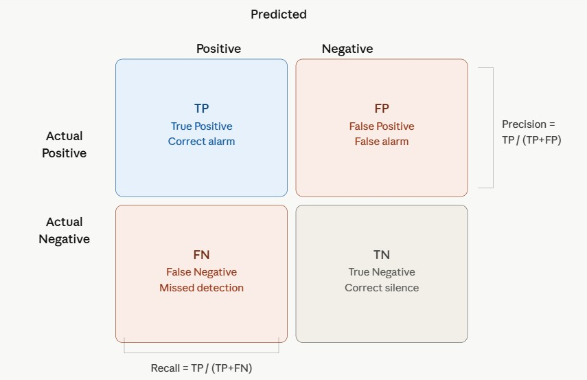

# Distributed Acoustic Sensing - Signal Processing

### What is DAS?

Distributed Acoustic Sensing (DAS) converts a standard optical fibre into a dense array of
acoustic sensors by measuring Rayleigh backscatter along the cable.  Each channel records the
axial strain rate at a fixed position along the fibre, giving a 2-D space–time dataset.


## Pipeline Overview


This project covers the first 6 steps.

## 1. Business Understanding


### 1.1 Submarine Cable Monitoring (Offshore Wind)

Offshore wind farms depend on subsea export and inter-array power cables to deliver
electricity to shore. Cable failure causes expensive downtime; repair
campaigns require specialised vessels and can take weeks. Cable failures are all difficult to detect by periodic vessel-based inspection.

**Objective:** Provide continuous, real-time health monitoring of subsea power cables —
detecting exposure, CPS abrasion, impact events, and electrical anomalies — to enable
proactive Operations and Maintenance decisions and reduce unplanned downtime.

**Key challenges:**
| | **Type** | **Time Domain** | **Frequency Domain** |
|---|---|---|---|
| **Anchor strike** | Target | Single high-energy transient, short duration (<< 1 s); hyperbolic arrival across channels | Broadband 100–400 Hz |
| **CPS abrasion** | Target | Repetitive scraping bursts, periodicity correlated with tidal/current cycle | Narrow-band, frequency set by contact mechanics |
| **Cable exposure** | Target | Gradual increase in strain amplitude; no discrete event | Energy concentration below 10 Hz |
| **Partial discharge** | Target | High-frequency burst, intermittent; localised to damage site | Above 1 kHz; broadband impulse |
| **Shipping noise** | Noise | Non-stationary, intermittent; linear moveout in space–time | Tonal lines 5–50 Hz; linear slope in f-k domain at vessel apparent velocity |
| **Ocean swell** | Noise | Low-frequency modulation correlated across all channels simultaneously | Below 1 Hz |
| **Whale vocalisation** | Noise | Structured call pattern, intermittent | Narrowband, species-dependent (typically 10–1000 Hz) |
| **Cable-guided elastic wave** | Noise | Arrives earlier than water-borne wavefront; same source, different path | Steep slope in f-k domain (apparent velocity several km/s) |


---
### 1.2 Water Pipeline Monitoring

Water utilities operate extensive buried pipeline networks that are difficult and costly
to inspect. Undetected leaks cause Non-Revenue Water losses that can exceed 20–30%
of total supply in ageing networks, while unauthorised intrusions and third-party damage
pose safety and service-continuity risks.

**Objective:** Detect and localise leaks and intrusions in real time, with sufficient
spatial precision (<10 m) to guide targeted repair without unnecessary excavation.


**Key challenges:**
| | **Type** | **Time Domain** | **Frequency Domain** |
|---|---|---|---|
| **Leak (orifice)** | Target | Continuous, stationary broadband noise; sustained for as long as leak is active | Broadband ~100 Hz – several kHz; spectral shape depends on pressure differential and orifice geometry |
| **Intrusion (drilling, excavation)** | Target | Impulsive mechanical transients, irregular repetition rate | Dominant energy below 500 Hz; broadband impact spectrum |
| **Pump harmonics** | Noise | Periodic,  in sync with pump rotation; highly repeatable | Narrow spectral lines at fundamental and integer harmonics; stable over time |
| **Valve operation** | Noise | Short-lived burst, isolated in time | Broadband, decaying rapidly after operation |
| **Water hammer** | Noise | Decaying oscillatory transient following rapid pressure change | Oscillatory spectrum at pipe resonance frequencies |


## 2. Data Understanding

### Source Publication

> J. Lin, Q. Wang, W. Zhang, J. Shu, L. Zhang and Q. Tang,
> "Estimation of Submarine Cable Location Using Optical-Fiber Distributed Acoustic Sensing
> Combined With Ship-Borne Sound Sources,"
> *Journal of Lightwave Technology*, vol. 43, no. 18, pp. 8917–8926, 15 Sept. 2025.
> doi: [10.1109/JLT.2025.3588069](https://doi.org/10.1109/JLT.2025.3588069)

The dataset is publicly available.


### Dataset Parameters

| Parameter | Value |
|-----------|-------|
| Sampling rate `fs` | 1000 Hz |
| Channel spacing `dx` | 4.09 m |
| Gauge length | 10 m |
| Aperture used | 1.0 – 3.0 km |
| Number of channels | 490 |
| Record length | 4.95 s |
| Water sound speed `c_water` | 1480 m/s |
| Bandpass applied | 1 – 148 Hz |

### File Format

Raw data are stored as per-channel binary **SAC** files (`Channel_XXXX.sac`).  

### Visualisation

The raw vs bandpass-filtered waterfall (time × distance) shows the hyperbolic arrival
pattern of the impulse wavefront, Scholte interface waves (slow, dispersive), and
persistent background noise.


---

## 3. Feature Engineering — Single-Channel Features


Seven features are extracted in a **sliding window** (window = 0.5 s, hop = 0.25 s) applied
to the bandpass-filtered strain-rate time series of the peak channel. 

| Feature | Domain | Description |
|---------|--------|-------------|
| **RMS** | Time | Root-mean-square amplitude — overall energy |
| **Peak** | Time | Maximum absolute amplitude |
| **Crest Factor** | Time | Peak / RMS — impulsiveness indicator |
| **Kurtosis** | Time | Fourth statistical moment — transient sharpness |
| **Band energy** | Frequency | Welch PSD mean, 1–50 Hz, 50–100 Hz， 100–148 Hz |
| **WPD sub-bands** | Frequency | Wavelet packet decomposition (db4, level 3, 62 Hz / band) |


---

## 4. Event Detection

### Current Method — L2 Anomaly Score

A combined **anomaly score** is formed by z-scoring all 7 features and computing their
L2 norm: `score = ‖z‖₂ = √(Σ zᵢ²)` (Root-sum-of-squares). 

Windows exceeding a threshold (default 2.5) define
the anomalous segment `t_window_anomaly` used in all subsequent analyses.


### Suggested Extension — Machine Learning Anomaly Detection

Applicable to both submarine cable and pipeline contexts. No label required.

- **Isolation Forest / One-Class SVM** on the 7-feature vector: trained on background
  windows only; flags observations that deviate from the learned noise distribution.
  Low complexity, fast inference, explainable via feature importance.
- **Autoencoder**: learns a compressed representation of
  normal background noise; elevated reconstruction error indicates an anomalous event.
  More sensitive to subtle spectral changes than hand-crafted features, but requires
  more data to train reliably.

Both methods output an anomaly score rather than a class label.

---

## 5. Source Localisation

### f-k Separation

A 2-D FFT is applied over the full (time × space) dataset.  A cosine-tapered mask
separates:
- **Acoustic component** — apparent velocity ≥ c_water (1480 m/s)
- **Scholte component** — apparent velocity 200–1480 m/s


### Hyperbola Fit

A point source at depth `z0` below the cable at along-cable position `x0` produces a
hyperbolic travel-time curve:

```
t(x) = t0 + √((x − x0)² + z0²) / c_water
```

**Procedure:**

1. The peak channel (highest amplitude in the anomalous segment) provides a template
   waveform.
2. Cross-correlation (CC) of every channel against the template yields per-channel
   arrival times.  Only picks with normalised CC ≥ 0.8 are retained.
3. `scipy.optimize.curve_fit` fits the three free parameters `(x0, z0, t0)` to the
   CC picks.  The initial estimate for `z0` is derived automatically from pick geometry:
   `z0 ≈ median(Δx² / (2 · c · Δt))`.

**Output:** source position `(x0, z0)` and excitation time `t0`.

**Result for Event 1:**

| Parameter | Value | Description |
|-----------|-------|-------------|
| `x0` | 2.08 km | Source position along cable |
| `z0` | 230 m | Source-to-cable perpendicular distance |
| `t0` | 0.49 s | Source excitation time |


---

## 6. Beamforming

### Short-Time Plane-Wave Beamforming

Applied to the acoustic-filtered component within the anomalous segment.  For each
short time window (50 ms, hop 10 ms) and each candidate slowness `p`:

```
B(p, t) = |Σₙ Xₙ(f) · exp(−j 2π f p xₙ)|²
```

The **slowness–time image** reveals:
- *When* energy arrives (time axis)
- *From which direction* (slowness axis, converted to incidence angle θ = arcsin(p · c))
- Multiple simultaneous arrivals appear as distinct blobs


## 7. Classification of Acoustic Events
### Quick discrimination guide

| Dimension | Question to ask | What it tells you |
|---|---|---|
| **Time domain** | Transient or continuous? | Transient → impact event (anchor strike, intrusion); continuous → leak or background noise |
| **Time domain** | Periodic or irregular? | Periodic → mechanical source (pump, rotating machinery); irregular → leak turbulence or random impacts |
| **Frequency domain** | Broadband or narrowband? | Broadband → turbulent/impact source (leak, strike); narrowband tonal → mechanical harmonic or CPS abrasion|
| **Frequency domain** | Where is the energy? | Below 10 Hz → cable exposure / swell; 5–50 Hz → shipping; 100 Hz–kHz → leak or impact |
| **Spatial domain** | Local or all channels? | All channels simultaneously → correlated noise (swell, earthquake); localised → discrete event near that position |
| **Spatial domain** | Linear moveout in space–time? | Yes → propagating source (vessel, wave); no → stationary source (leak, fixed machinery) |
| **Apparent velocity** | Fast or slow? | >> c_water (1480 m/s) → cable-guided elastic wave; ~ c_water → water-borne acoustic; << c_water → Scholte / interface wave |


### Supervised machine learning algorithms


DAS monitoring serves two distinct operational contexts — submarine cable and water pipeline monitoring — each with different signal and noise characteristics that shape the choice of classification approach.


Unsupervised anomaly detection (see Section 4) flags abnormal windows without requiring
labels. Once confirmed events have been annotated by operators, a supervised classifier
can distinguish between event types. Label availability remains the primary constraint.

**Feature vector approach** — hand-crafted features (energy, impulsiveness, spectral
shape, slowness, source distance) are fed to a gradient boosting classifier
(XGBoost / LightGBM) or random forest. Robust to small labelled datasets; SHAP values provide per-alert
explanation auditable by operators. Applicable to both submarine cable and pipeline
contexts from early deployment.

**Spectrogram-based approach** — a 2-D CNN operates directly on the time–frequency
representation, bypassing manual feature engineering:


- *Submarine cable*: the f-k-filtered spectrogram encodes hyperbolic moveout patterns
  that carry both event type and source geometry; most effective when labelled data
  from multiple wind farms is pooled.
- *Water pipeline*: the short-time spectrogram separates broadband leak noise from
  narrow pump harmonic lines as visually distinct spatial textures; a CNN can use
  these directly without manual spectral feature design.

In both cases, leak and rare fault classes are underrepresented in training data;
class-weighted loss is necessary to prevent the classifier from
ignoring minority classes.


## 8. Evaluation and Deployment

### Model evaluation

Trained classifiers are evaluated on held-out event windows using standard metrics: precision, recall, and F1-score per class, with particular attention to recall on rare fault classes (leaks, anchor strikes) where missed detections carry high operational cost.



### Deployment architecture

Signal processing and machine learning pipelines are packaged as **Docker containers** to ensure reproducible environments across testing and deployment. 

**CI/CD**: A GitHub Actions pipeline runs on every push: automated testing and deployment of model updates, eliminating manual intervention.


## Repository Structure

```
distributed-acoustic-sensing/
├── DAS_Signal_Processing.ipynb   # Main analysis notebook
├── utils/
│   └── plot_style.py             # Colour palettes and figure sizes
├── PubDAS_data/                  # Raw SAC files (not included)
│   └── DAS data for submarine cable detection/1/
├── plots/                        # Saved figures (auto-generated)
└── README.md
```

---

## Requirements

See `requirements.txt`.  Install with:

```bash
pip install -r requirements.txt
# Optional wavelet support:
conda install -c conda-forge pywavelets
```

---
