# Distributed Acoustic Sensing - Signal Processing

### What is DAS?

Distributed Acoustic Sensing (DAS) converts a standard optical fibre into a dense array of
acoustic sensors by measuring Rayleigh backscatter along the cable.  Each channel records the
axial strain rate at a fixed position along the fibre, giving a 2-D space–time dataset.


## Pipeline Overview

| Step | Summary |
|---|---|
| **1. Business Understanding** | Leak/intrusion detection in water pipelines; anchor strike, CPS abrasion, and cable exposure monitoring in offshore wind subsea cables |
| **2. Data Understanding** | Public DAS dataset, raw SAC format |
| **3. Feature Engineering** | 7 single-channel features in sliding windows
| **4. Event Detection** | anomaly score across all 7 z-scored features flags anomalous segment;        
|   |      Unsupervised extension: Isolation Forest / Autoencoder on feature vector |
| **5. Source Localisation** | f-k separation isolates acoustic vs Scholte components; cross-correlation picks + hyperbola fit yields source position and excitation time|
| **6. Beamforming** | Plane-wave slowness–time image reveals arrival direction and timing;
| **7. Classification** | Supervised classification of labelled event types; feature vector and spectrogram  |


---

## 1. Business Understanding


### 1.1 Submarine Cable Monitoring (Offshore Wind)

Offshore wind farms depend on subsea export and inter-array power cables to deliver
electricity to shore. Cable failure causes expensive downtime; repair
campaigns require specialised vessels and can take weeks. Cable failures are all difficult to detect by periodic vessel-based inspection.

**Objective:** Provide continuous, real-time health monitoring of subsea power cables —
detecting exposure, CPS abrasion, impact events, and electrical anomalies — to enable
proactive Operations and Maintenance decisions and reduce unplanned downtime.

**Key challenges:**
| | **Type** | **Time Domain** | **Frequency Domain** |
|---|---|---|---|
| **Anchor strike** | Target | Single high-energy transient, short duration (<< 1 s); hyperbolic arrival across channels | Broadband 100–400 Hz |
| **CPS abrasion** | Target | Repetitive scraping bursts, periodicity correlated with tidal/current cycle | Narrow-band tonal, frequency set by contact mechanics |
| **Cable exposure** | Target | Gradual increase in low-frequency strain | Energy concentration below 10 Hz |
| **Shipping noise** | Noise | Non-stationary, intermittent; linear moveout in space–time | Tonal lines 5–50 Hz; linear slope in f-k domain at vessel apparent velocity |
| **Ocean swell** | Noise | Low-frequency modulation correlated across all channels simultaneously | Below 1 Hz |
| **Whale vocalisation** | Noise | Structured call pattern, intermittent | Narrowband, species-dependent (typically 10–1000 Hz) |
| **Cable-guided elastic wave** | Noise | Arrives earlier than water-borne wavefront; same source, different path | Steep slope in f-k domain (apparent velocity >> c_water = 1480 m/s) |


---
### 1.2 Water Pipeline Monitoring

Water utilities operate extensive buried pipeline networks that are difficult and costly
to inspect. Undetected leaks cause Non-Revenue Water losses that can exceed 20–30%
of total supply in ageing networks, while unauthorised intrusions and third-party damage
pose safety and service-continuity risks.

**Objective:** Detect and localise leaks and intrusions in real time, with sufficient
spatial precision (<10 m) to guide targeted repair without unnecessary excavation.


**Key challenges:**
| | **Type** | **Time Domain** | **Frequency Domain** |
|---|---|---|---|
| **Leak (orifice)** | Target | Continuous, stationary broadband noise; sustained for as long as leak is active | Broadband ~100 Hz – several kHz; spectral shape depends on pressure differential and orifice geometry |
| **Intrusion (drilling, excavation)** | Target | Impulsive mechanical transients, irregular repetition rate | Dominant energy below 500 Hz; broadband impact spectrum |
| **Pump harmonics** | Noise | Periodic, synchronised with pump rotation; highly repeatable | Narrow spectral lines at fundamental and integer harmonics; stable over time |
| **Valve actuation** | Noise | Short-lived burst, isolated in time | Broadband, decaying rapidly after actuation |
| **Water hammer** | Noise | Decaying oscillatory transient following rapid pressure change | Oscillatory spectrum at pipe resonance frequencies, decaying envelope |


## 2. Data Understanding

### Source Publication

> J. Lin, Q. Wang, W. Zhang, J. Shu, L. Zhang and Q. Tang,
> "Estimation of Submarine Cable Location Using Optical-Fiber Distributed Acoustic Sensing
> Combined With Ship-Borne Sound Sources,"
> *Journal of Lightwave Technology*, vol. 43, no. 18, pp. 8917–8926, 15 Sept. 2025.
> doi: [10.1109/JLT.2025.3588069](https://doi.org/10.1109/JLT.2025.3588069)

The dataset is publicly available.


### Dataset Parameters

| Parameter | Value |
|-----------|-------|
| Sampling rate `fs` | 1000 Hz |
| Channel spacing `dx` | 4.09 m |
| Gauge length | 10 m |
| Aperture used | 1.0 – 3.0 km |
| Number of channels | 490 |
| Record length | 4.95 s |
| Bandpass applied | 1 – 148 Hz |
| Water sound speed `c_water` | 1480 m/s |
| Number of events | 10 (event_id 1–10) |

### File Format

Raw data are stored as per-channel binary **SAC** files (`Channel_XXXX.sac`).  
Each file contains a 70-float + 40-int header followed by 32-bit float waveform samples.

### Visualisation

The raw vs bandpass-filtered waterfall (time × distance) shows the hyperbolic arrival
pattern of the plasma-pulse wavefront, Scholte interface waves (slow, dispersive), and
persistent background noise.

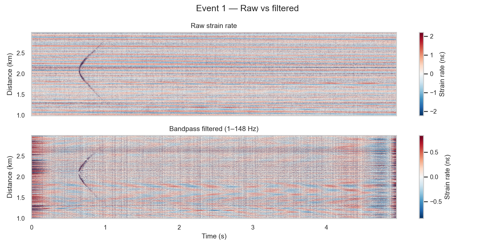

---

## 3. Feature Engineering — Single-Channel Features

Seven features are extracted in a **sliding window** (window = 0.5 s, hop = 0.25 s) applied
to the bandpass-filtered strain-rate time series of the peak channel.

| Feature | Domain | Description |
|---------|--------|-------------|
| **RMS** | Time | Root-mean-square amplitude — overall energy |
| **Peak** | Time | Maximum absolute amplitude |
| **Crest Factor** | Time | Peak / RMS — impulsiveness indicator |
| **Kurtosis** | Time | Fourth statistical moment — transient sharpness |
| **Band energy Lo** | Frequency | Welch PSD mean, 1–50 Hz |
| **Band energy Mid** | Frequency | Welch PSD mean, 50–100 Hz |
| **Band energy Hi** | Frequency | Welch PSD mean, 100–148 Hz |
| **WPD sub-bands** | Frequency | Wavelet packet decomposition (db4, level 3, 62 Hz / band) |

A combined **anomaly score** is formed by z-scoring all 7 features and computing their
L2 norm: `score = ‖z‖₂ = √(Σ zᵢ²)`.  Windows exceeding a threshold (default 2.5) define
the anomalous segment `t_window_anomaly` used in all subsequent analyses.

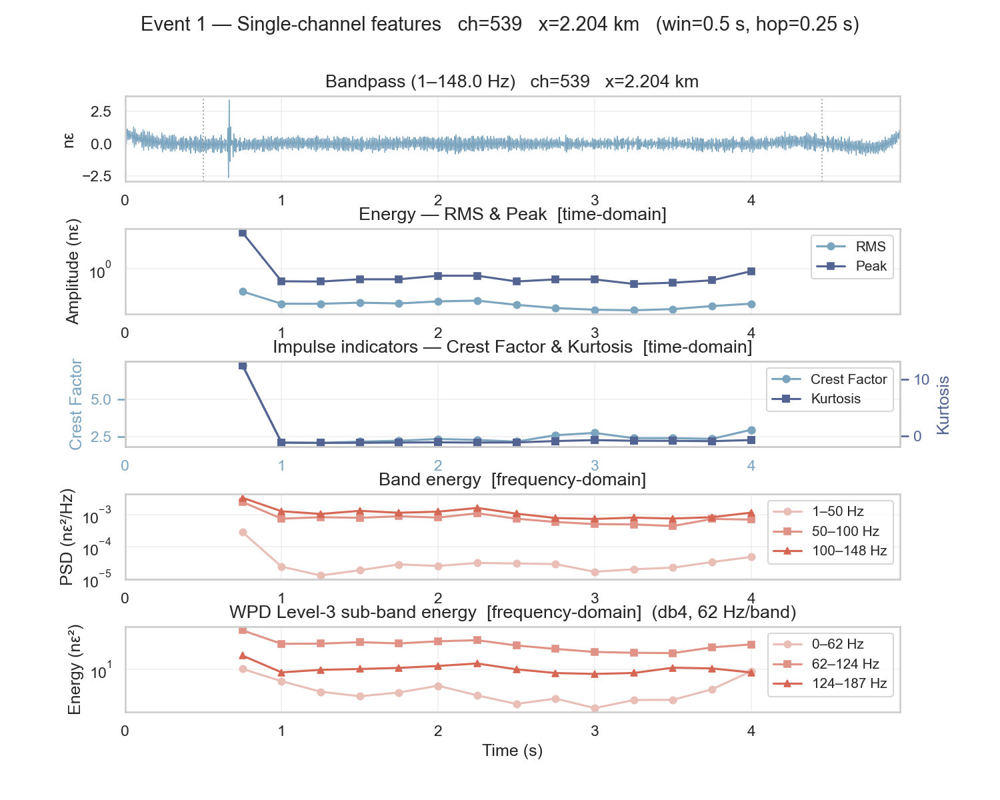

---

## 4. Event Detection

### Current Method — RMS Sliding Window + L2 Anomaly Score

1. A 0.5 s sliding window scans the full record; the window with maximum RMS energy defines
   the event time.
2. The 7-feature L2 z-score (Section 3) identifies the precise anomalous segment and
   outputs `t_window_anomaly`.

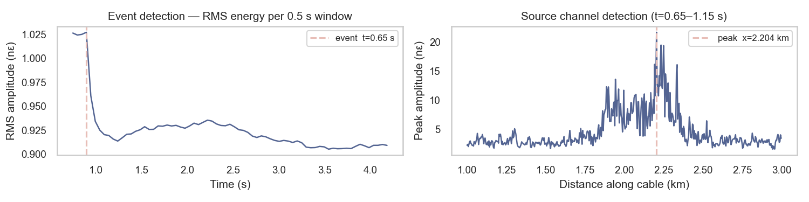

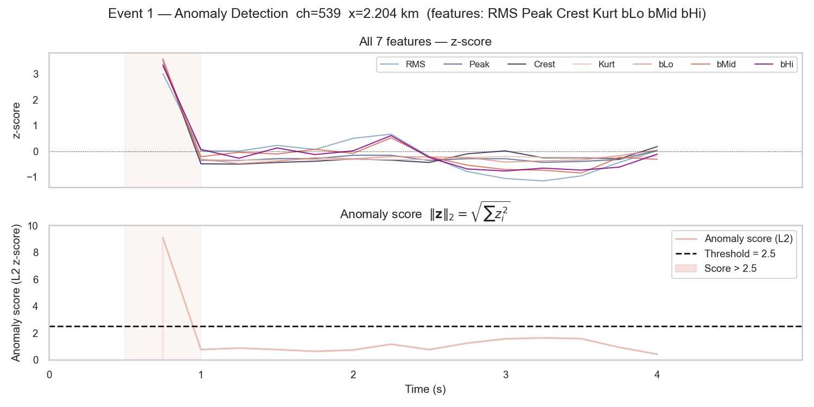


### Suggested Extension — Machine Learning Anomaly Detection

Applicable to both submarine cable and pipeline contexts from day one.

- **Isolation Forest / One-Class SVM** on the 7-feature vector: trained on background
  windows only; flags observations that deviate from the learned noise distribution.
  Low complexity, fast inference, explainable via feature importance.
- **Autoencoder on short-time spectrograms**: learns a compressed representation of
  normal background noise; elevated reconstruction error indicates an anomalous event.
  More sensitive to subtle spectral changes than hand-crafted features, but requires
  more data to train reliably.

Both methods output an anomaly score rather than a class label, which is appropriate
when the event taxonomy is not yet defined. 

---

## 5. Source Localisation

### f-k Separation

A 2-D FFT is applied over the full (time × space) dataset.  A cosine-tapered mask
separates:
- **Acoustic component** — apparent velocity ≥ c_water (1480 m/s)
- **Scholte component** — apparent velocity 200–1480 m/s


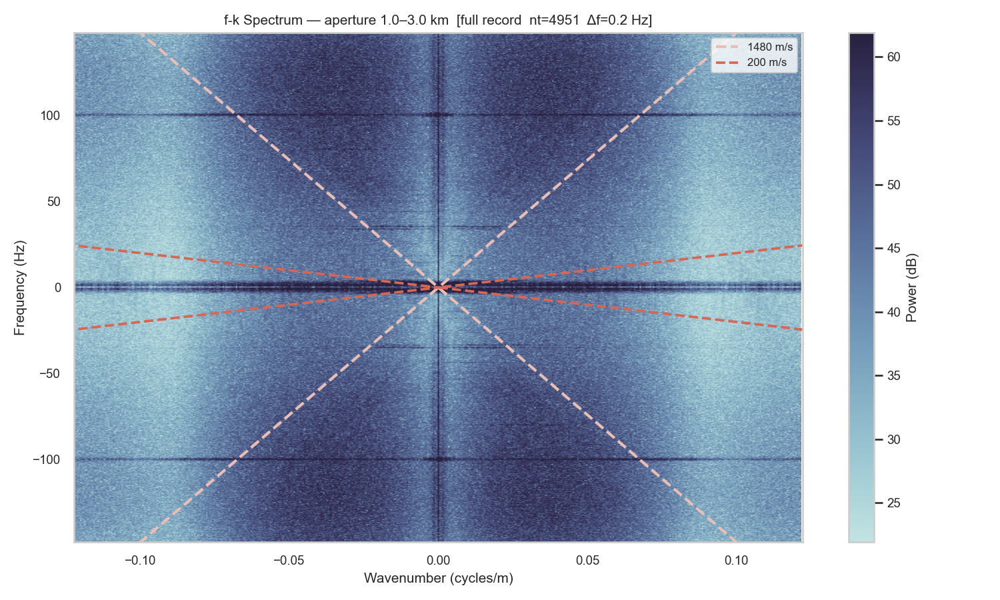

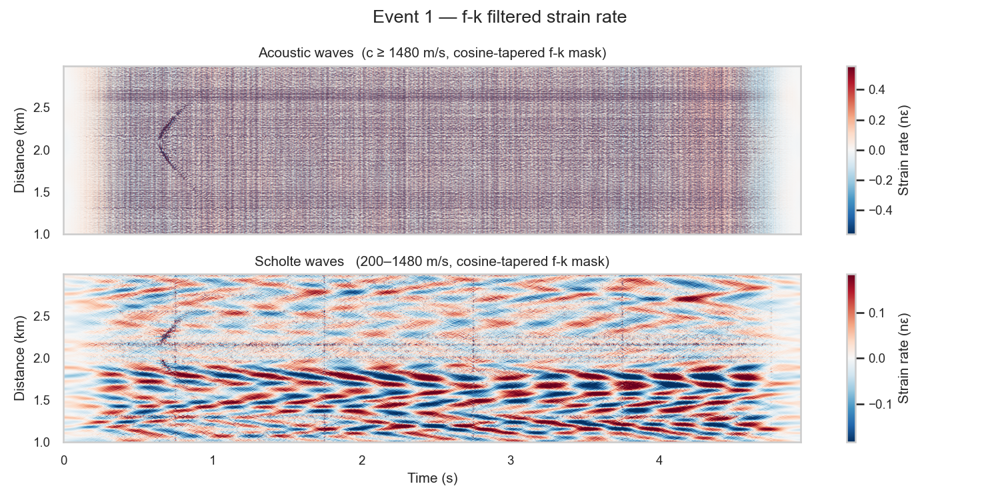

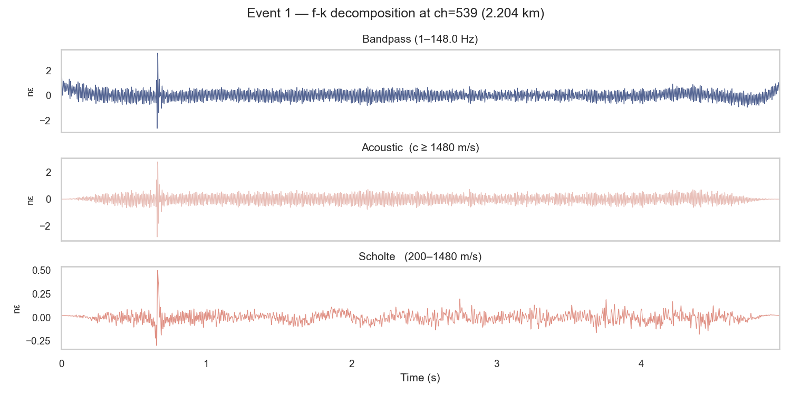


### Hyperbola Fit

A point source at depth `z0` below the cable at along-cable position `x0` produces a
hyperbolic travel-time curve:

```
t(x) = t0 + √((x − x0)² + z0²) / c_water
```

**Procedure:**

1. The peak channel (highest amplitude in the anomalous segment) provides a template
   waveform.
2. Cross-correlation (CC) of every channel against the template yields per-channel
   arrival times.  Only picks with normalised CC ≥ 0.8 are retained.
3. `scipy.optimize.curve_fit` fits the three free parameters `(x0, z0, t0)` to the
   CC picks.  The initial estimate for `z0` is derived automatically from pick geometry:
   `z0 ≈ median(Δx² / (2 · c · Δt))`.

**Output:** source position `(x0, z0)` and excitation time `t0`.

**Result for Event 1:**

| Parameter | Value | Description |
|-----------|-------|-------------|
| `x0` | 2.08 km | Source position along cable |
| `z0` | 230 m | Source-to-cable perpendicular distance |
| `t0` | 0.49 s | Source excitation time |

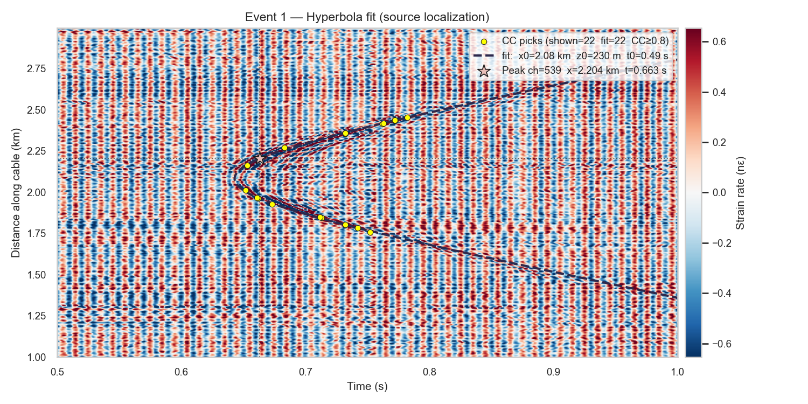

---

## 6. Beamforming

### Short-Time Plane-Wave Beamforming

Applied to the acoustic-filtered component within the anomalous segment.  For each
short time window (50 ms, hop 10 ms) and each candidate slowness `p`:

```
B(p, t) = |Σₙ Xₙ(f) · exp(−j 2π f p xₙ)|²
```

The **slowness–time image** reveals:
- *When* energy arrives (time axis)
- *From which direction* (slowness axis, converted to incidence angle θ = arcsin(p · c))
- Multiple simultaneous arrivals appear as distinct blobs

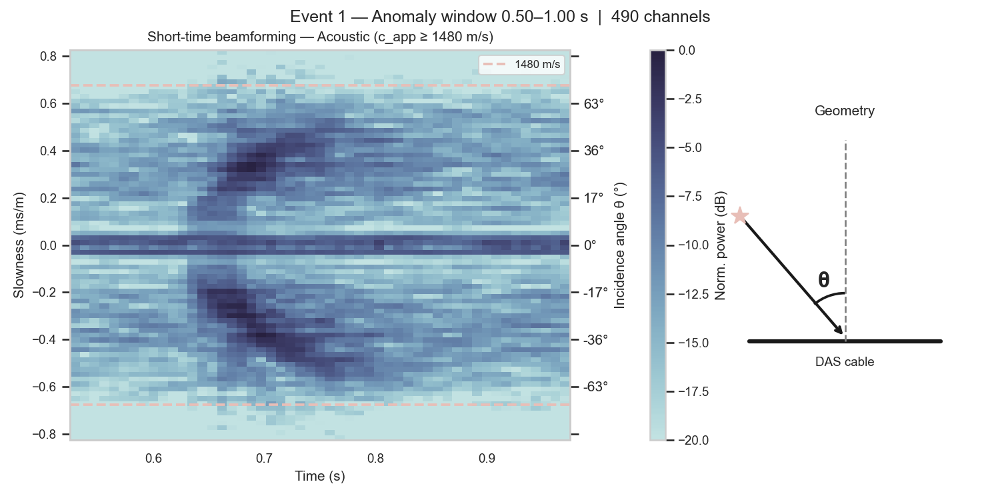

### Focused DAS

Using the source position `(x0, z0)` from the hyperbola fit, spherical-wave delays are
computed for each channel:

```
τₙ = √((xₙ − x0)² + z0²) / c_water
```

Frequency-domain delay-and-sum with CC-quality-weighted channel selection (N = 22 channels)
produces a beamformed time-domain signal with improved coherence.

> **Note on limitations:** For near-field point sources observed by DAS, the beamformed SNR
> gain is limited by spatially correlated noise and the cos²(θ) DAS directional sensitivity.
> The peak single channel may outperform the array average in this geometry.

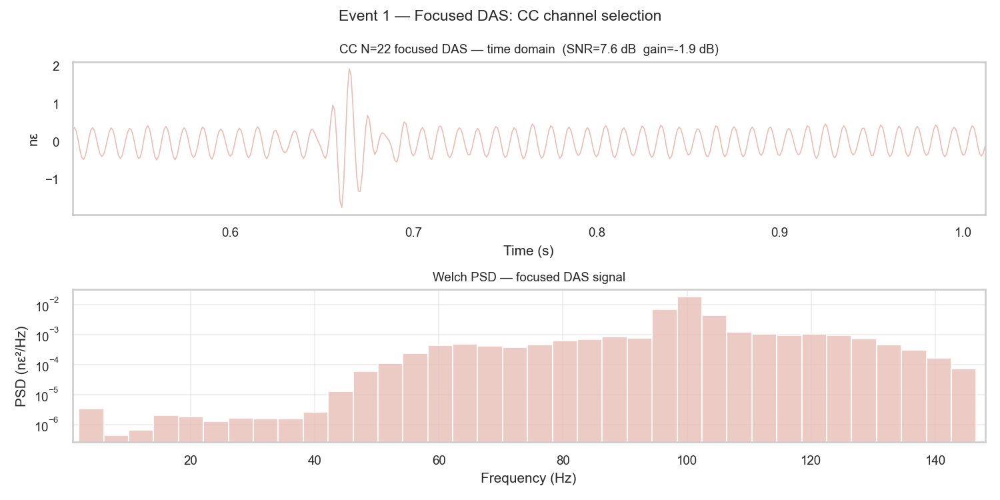


## 7. Supervised Classification of Acoustic Events

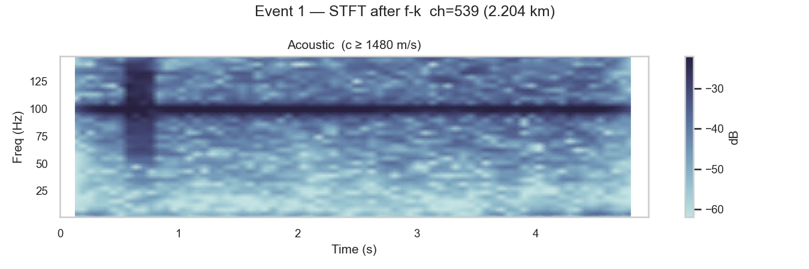

DAS monitoring serves two distinct operational contexts — submarine cable surveillance
and water pipeline monitoring — each with different signal and noise characteristics
that shape the choice of classification approach.


Unsupervised anomaly detection (see Section 4) flags abnormal windows without requiring
labels. Once confirmed events have been annotated by operators, a supervised classifier
can distinguish between event types. Label availability remains the primary constraint —
the approaches below are ordered from least to most data-hungry.

**Submarine cable** — target classes include anchor strike, CPS abrasion, cable
exposure, vessel passage, and background. Events are transient and spatially localised,
so the feature vector should include directional and spatial features:

- **Gradient Boosting (XGBoost / LightGBM)** on the full feature vector (energy,
  impulsiveness, spectral shape, slowness, source distance): robust to the small
  labelled datasets typical of early deployments; SHAP values provide per-alert
  explanation auditable by operators.
- **CNN on the f-k-filtered spectrogram**: the hyperbolic moveout pattern encodes both
  event type and source geometry as a 2-D image; effective when labelled data from
  multiple wind farms is pooled.

**Water pipeline** — target classes are typically leak, intrusion, pump transient, and normal.
Leaks are continuous and stationary, not transient, so temporal context matters:

- **Sliding-window Gradient Boosting**: classify each 0.5 s window independently, then
  apply temporal smoothing (majority vote or hidden Markov model) over consecutive
  windows to suppress isolated false positives from valve transients.
- Leak signals are rare in labelled training sets; **class-weighted loss or SMOTE
  oversampling** is necessary to prevent the classifier from ignoring the minority class.


---

## Repository Structure

```
distributed-acoustic-sensing/
├── DAS_Signal_Processing.ipynb   # Main analysis notebook
├── utils/
│   └── plot_style.py             # Colour palettes and figure sizes
├── PubDAS_data/                  # Raw SAC files (not included)
│   └── DAS data for submarine cable detection/1/
├── plots/                        # Saved figures (auto-generated)
└── README.md
```

---

## Requirements

See `requirements.txt`.  Install with:

```bash
pip install -r requirements.txt
# Optional wavelet support:
conda install -c conda-forge pywavelets
```

---
